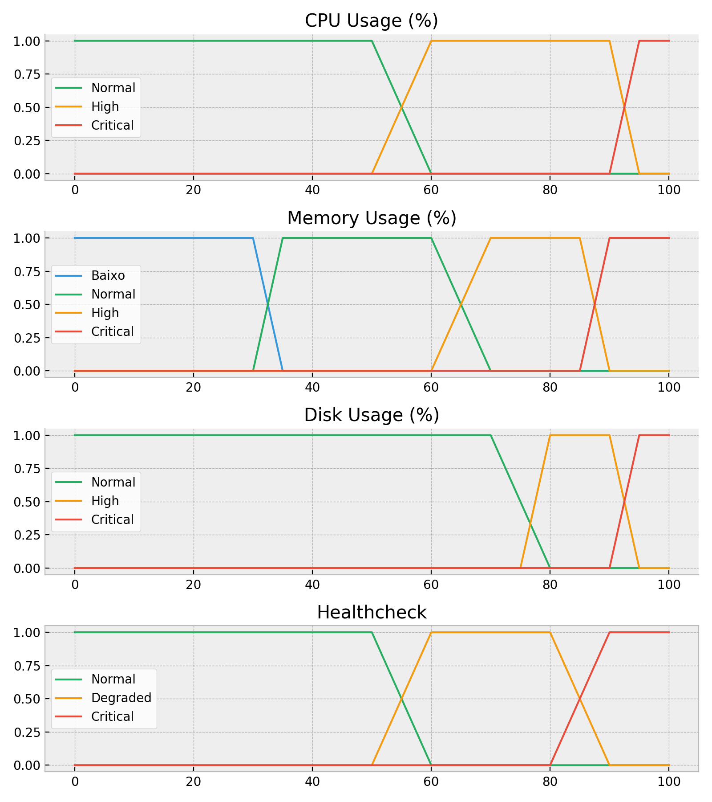

# IT Infrastructure monitoring with Fuzzy Logic 

Project that uses Fuzzy Logic to monitor a computer, analyzing CPU, Disk and Memory and outputs the **healthcheck** on screen with `matplotlib`.

The Fuzzy Logic rules are:

- If **CPU** is critical or **MEMORY** is critical is critical or **DISK** is critical then **HEALTHCHECK** is critical
- If **CPU** or **MEMORY** is high then **HEALTHCHECK** is degraded
- All rest then **HEALTCHCHECK** is normal

The thresholds of each variable is:

## Application parts

- `monitor.py`: process responsible for gathering computer data (cpu, memory and disk usage). Group these informations and save them on file on format: TIMESTAMP;DISK;CPU;MEMORY to be read after by the process `fuzzy.py`. 
- `fuzzy.py`: Read data from `monitor.py` process, fuzzify, generate and update the environment healthcheck chart.
- `load\_cpu.py`: Process that load CPU, simulating a situation of high processing usage. 
- `load\_memory.py`: Process that load memory, simulating a situation of high memory usage. 

## Instalation

- (Optional) Create a virtual environment with `virtualenv` (first install it with `pip install virtualenv`, execute `virtualenv venv` then activate it with `source venv/bin/activate`)
- Install dependencies with `pip install -r requirements.txt`

### Dependencies

- `scikit-fuzzy`: Collection of algorithms to use fuzzy logic on Python. 
- `numpy`: Scientific Computing library.
- `psutil`: Process and System Utilities - Library to gather process and computing resources information and utilization. 
- `matplotlib`: Library to generate charts 

## Configuration

There is a `Setting` class on `settings.py` that controls some of the application configurations. They are the following:

- `DISK_USAGE_THRESHOLD = (int)`: Threshold just to colorize the disk column on `monitor.py` to red when `(int)` value is reached.
- `MEMORY_USAGE_THRESHOLD = (int)`: Threshold just to colorize the memory column on `monitor.py` to red when `(int)` value is reached.
- `CPU_USAGE_THRESHOLD = (int)`: Threshold just to colorize the cpu column on `monitor.py` to red when `(int)` value is reached.
- `DUMMY_DISK_USAGE = (bool)`: Boolean that tells the application to use the real disk usage or use a random value (as rising the disk usage is complex, it's easier to just use a random number).
- `MONITORING_PERIOD_IN_SECONDS = (float)`: Cycle to gather computer data.
- `PLOT_PERIOD_IN_SECONDS = (int)`: Cycle to show the chart on screen.

## Usage

To execute the whole project:

- First, execute the code `monitor.py` to read your computer data
- Then, execute `fuzzy.py` to generate the resulting charts of luzzy logic
- (Optional) To rise the CPU load, execute `load_cpu.py`
- (Optional) To rise the memory load, execute `load_memory.py` 
